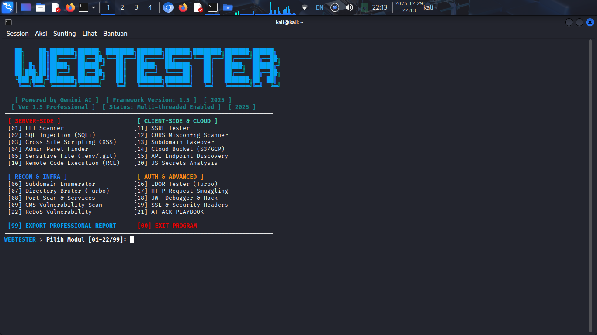
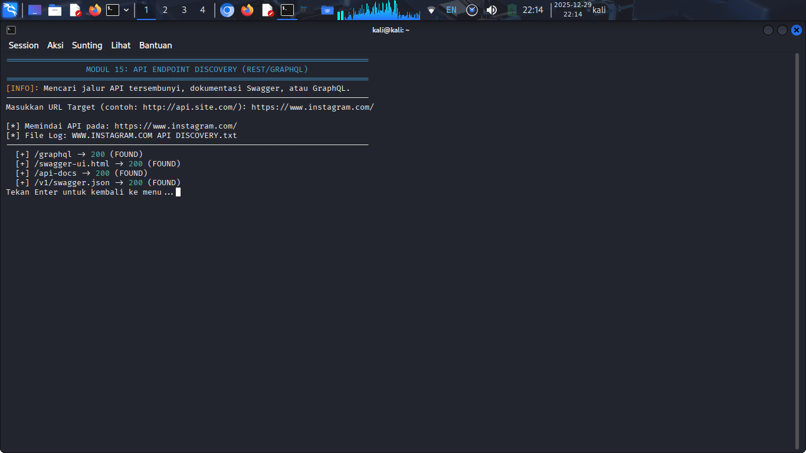
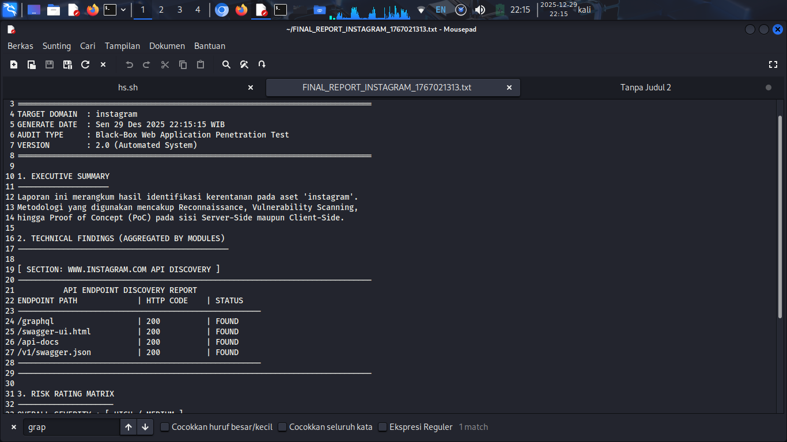

# 🌐 WEBTESTER v1.5 - All-in-One Pentesting Framework


**WEBTESTER** adalah framework pengujian keamanan web berbasis Bash yang dirancang untuk mengotomatisasi berbagai tahap penetrasi dengan kecepatan tinggi menggunakan sistem **Turbo Multi-threading**.

**WEBTESTER** *is a Bash-based web security testing framework designed to automate various penetration stages with high speed using the Turbo Multi-threading system.*

---

## 📸 Tampilan & Hasil / Interface & Results

Berikut adalah dokumentasi visual dari antarmuka dan proses pemindaian WEBTESTER:
*Below is the visual documentation of the WEBTESTER interface and scanning process:*

### 1. Main Menu Interface
Tampilan menu utama yang terorganisir berdasarkan kategori serangan.
*Main menu interface organized by attack categories.*


### 2. Scanning Process (Turbo Mode)
Proses pemindaian cepat menggunakan multi-threading.
*Fast scanning process using multi-threading.*


### 3. Professional Audit Report
Hasil laporan audit dalam format tabel yang rapi.
*Audit report results in a neat table format.*


---

## 🇮🇩 Bahasa Indonesia

### 📝 Catatan Pengembang
Saya tahu script ini masih belum sempurna dan masih perlu banyak perbaikan di berbagai sisi. Oleh karena itu, saya memutuskan untuk menjadikan project ini **Open Source** agar kalian bisa mengembangkannya lebih jauh lagi. Keamanan siber terus berkembang, dan kolaborasi adalah kunci untuk tetap selangkah di depan.

Jika Anda ingin berkolaborasi, memberikan saran, atau melaporkan bug, silakan hubungi saya melalui Gmail. Terima kasih banyak atas dukungan dan donasi yang telah diberikan, itu sangat berarti bagi kelangsungan pengembangan alat ini.

**Salam hormat, KANG ANOM**

---

## 🇺🇸 English

### 📝 Developer's Note
*I am aware that this script is still far from perfect and requires significant improvements in many areas. For this reason, I have made this project **Open Source** so that the community can further develop and enhance its capabilities. Cybersecurity is constantly evolving, and collaboration is key to staying ahead.*

*If you are interested in collaborating, offering suggestions, or reporting bugs, please reach out to me via Gmail. Thank you so much for your support and donations; they are greatly appreciated and help sustain the development of this tool.*

***Best regards, KANG ANOM***

---

## 📬 Kontak & Donasi / Contact & Donation

Jika Anda merasa alat ini bermanfaat, dukung pengembangan lebih lanjut melalui link di bawah ini:
*If you find this tool useful, support further development via the link below:*

* **Gmail**: [kalicianting@gmail.com](mailto:kalicianting@gmail.com)
* **Donasi / Donation**: [👉 **Klik di sini untuk Donasi / Click here for Donation**](https://sfl.gl/RCU0)

---

## 🚀 Fitur Utama / Main Features

* **Turbo Engine**: Multi-threading pada modul Directory Bruter & IDOR.
* **Complete Modules**: Mencakup LFI, SQLi, XSS, RCE, SSRF, hingga JWT & Smuggling.
* **Professional Reporting**: Auto-generate laporan audit per domain (Modul 99).

---

## 🛠️ Instalasi / Installation

Pastikan Anda berada di direktori project setelah melakukan clone:
*Make sure you are in the project directory after cloning:*

```bash
# Clone repository
git clone [https://github.com/Kang-anom/WEBTESTER.git](https://github.com/Kang-anom/WEBTESTER.git)

# Masuk ke direktori / Enter directory
cd WEBTESTER

# Berikan izin eksekusi / Grant execution permission
chmod +x webtester.sh

# Jalankan framework / Run framework
./webtester.sh
